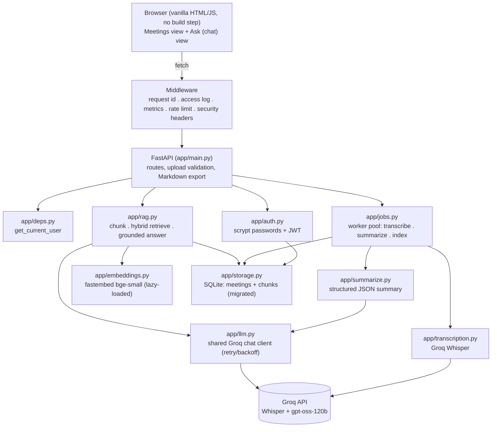
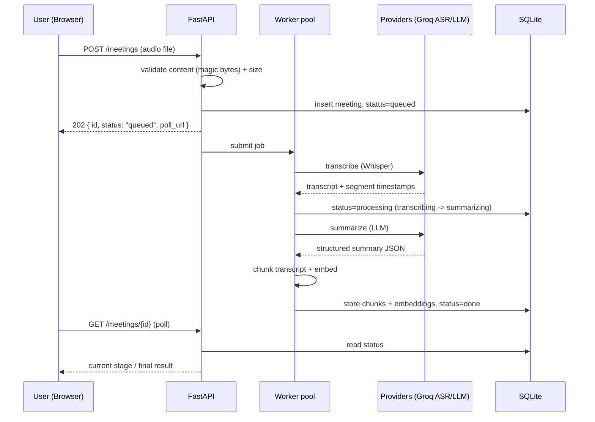
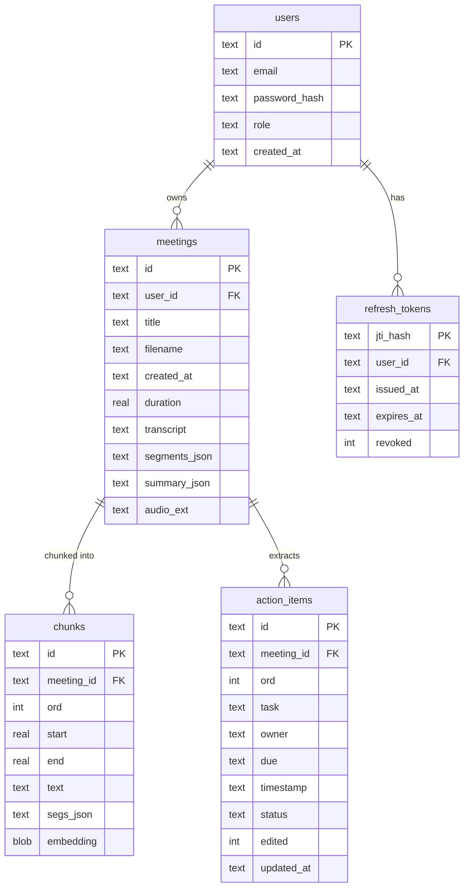

# MeetSaransh - Meeting Summarizer

[](https://github.com/R1tulD3v/MeetSaransh/actions/workflows/ci.yml)


Transcribe meeting audio, generate **action-oriented** summaries, and **ask questions
across all your meetings** with grounded, cited answers.

> _Saransh_ (सारांश) is Hindi for "summary".

**Pipelines:**
`audio -> validate -> transcribe (Whisper) -> summarize (LLM) -> store -> view`
`question -> hybrid retrieval -> grounded answer (LLM) -> cited excerpts`

**Repository:** [github.com/R1tulD3v/MeetSaransh](https://github.com/R1tulD3v/MeetSaransh)
**Live demo:** none hosted - runs locally in under two minutes, see [Getting Started](#getting-started)
**License:** no `LICENSE` file is currently checked into this repository (see [License](#license))

---

## Table of Contents

- [Project Overview](#project-overview)
- [Key Highlights](#key-highlights)
- [Features](#features)
- [Tech Stack](#tech-stack)
- [System Architecture](#system-architecture)
- [Request Lifecycle](#request-lifecycle)
- [Folder Structure](#folder-structure)
- [Getting Started](#getting-started)
- [Environment Variables](#environment-variables)
- [Usage](#usage)
- [Screenshots](#screenshots)
- ["Ask your meetings" - how the RAG works](#ask-your-meetings---how-the-rag-works)
- [Measuring the retrieval pipeline](#measuring-the-retrieval-pipeline)
- [Action items as state, not text](#action-items-as-state-not-text)
- [The insights dashboard](#the-insights-dashboard)
- [Engineering Decisions](#engineering-decisions)
- [Background processing](#background-processing)
- [Performance Considerations](#performance-considerations)
- [Security](#security)
- [Scalability](#scalability)
- [Testing](#testing)
- [API Documentation](#api-documentation)
- [Database Design](#database-design)
- [Deployment](#deployment)
- [Challenges Faced](#challenges-faced)
- [What I Learned](#what-i-learned)
- [Limitations](#limitations)
- [Roadmap](#roadmap)
- [Resume Talking Points](#resume-talking-points)
- [Interview Talking Points](#interview-talking-points)
- [Contributing](#contributing)
- [License](#license)
- [Contact](#contact)

---

## Project Overview

**The problem:** meeting notes are either skipped entirely or captured as a wall of
prose that nobody re-reads. Action items get agreed verbally, live only in someone's
memory or a chat message, and by the next meeting nobody can prove who owns what - or
find the one sentence, three meetings ago, where a decision was actually made.

**What MeetSaransh does:** upload a recording and it produces a transcript, a layered
summary (TL;DR, decisions, action items, open questions, topic timeline), and adds the
meeting to a searchable corpus. A chat interface answers questions **across every
meeting on the account**, grounded in retrieved transcript excerpts with clickable
citations - not a free-floating LLM guess.

**Who it helps:** anyone who runs or attends recurring meetings and wants the output to
be a queryable record instead of an audio file nobody replays - most directly, small
teams without a dedicated notetaker or a paid meeting-intelligence subscription.

**Engineering value:** the project is deliberately built as a full-stack, production-
shaped system rather than a notebook demo - authentication and per-user data isolation,
background job processing with crash recovery, a measured (not assumed) retrieval
pipeline with a CI regression gate, observability, and a test suite that runs offline.
Each of those is documented below with the reasoning behind it, not just the fact that
it exists.

**Elevator pitch:** MeetSaransh turns meeting audio into a structured, editable,
searchable record - and every claim in this README about how well the search works is
backed by a number from `evaluation/`, not an assertion.

---

## Key Highlights

Only functionality that is implemented and tested is listed here.

- Multi-user accounts with JWT auth and SQL-enforced per-user data isolation
- Retrieval-augmented Q&A (hybrid dense + lexical search) across every stored meeting
- Streamed answers over Server-Sent Events with citations arriving before the first token
- Background job processing (thread pool + DB-backed status) with crash recovery
- A measured, ablated retrieval pipeline with a labelled eval set and a CI regression gate
- An insights dashboard built entirely from SQL aggregations (no analytics service)
- Editable action items, tracked separately from the immutable model output
- Structured JSON logging, Prometheus metrics, and a real container health check
- Multi-stage, non-root Docker build with a CI pipeline that builds and smoke-tests it
- 577 tests / 98% coverage, with every provider (Groq) call mocked - the suite runs offline

---

## Features

### Core Features

| Feature | Description |
| --- | --- |
| Audio upload | `.mp3 .wav .m4a .mp4 .webm .ogg .flac` and more -> transcript + summary |
| Layered summary | TL;DR -> key decisions -> action items -> open questions -> topic timeline |
| Editable action items | Owner, due date, `[mm:ss]` timestamp; reassignable and completable inline, with an `edited` flag distinguishing model output from human edits |
| Ask your meetings (RAG) | Hybrid semantic + keyword search across every meeting, with query rewriting, streamed answers, and clickable timestamped citations |
| Click-to-seek | Timestamps in the summary, transcript, and chat citations all seek the audio / scroll the transcript |
| Transcript search | Client-side search with match highlighting |
| Insights dashboard | Action items by owner, meeting cadence, recurring topics - all SQL aggregations |
| Markdown export | Copy-ready export of a meeting's summary |
| Offline demo mode | A bundled sample meeting runs the whole app with no API key |

### Advanced Features

| Feature | Description |
| --- | --- |
| Hybrid retrieval | Dense (`fastembed` bge-small, cosine) + lexical (BM25) combined, tunable via `alpha` |
| Query rewriting | An LLM rewrites the question into retrieval vocabulary before search; measured to roughly double paraphrase recall@1 (see [the RAG section](#ask-your-meetings---how-the-rag-works)) |
| Two-layer grounding | A similarity gate plus an LLM prompt that may only answer from retrieved excerpts |
| Optional reranking | A cross-encoder second stage exists, is tested, and ships **disabled** because the eval harness measured it hurting results on the current corpus size |
| Retrieval evaluation harness | Ablation, alpha sweep, rerank A/B, rewrite A/B, and an LLM-as-judge faithfulness mode |

### Engineering Features

| Feature | Description |
| --- | --- |
| Auth & isolation | scrypt password hashing, JWT access + rotating refresh tokens, `user_id` filtering enforced in every storage query |
| Background jobs | Thread pool worker, DB-backed status machine, interrupted jobs fail cleanly at startup instead of silently retrying |
| Observability | JSON logs with request-id correlation, Prometheus metrics, route-template labels to bound cardinality |
| Rate limiting | Per-account, per-endpoint sliding window, tightest on endpoints that call paid APIs |
| Content-validated uploads | Magic-byte checks, streamed to disk with the size cap enforced as bytes arrive |
| Schema migrations | Hand-rolled, versioned via `PRAGMA user_version` - the database upgrades in place |
| CI pipeline | Lint, format, type-check, tests + coverage gate, retrieval regression gate, dependency audit, Docker build + smoke test |
| Containerization | Multi-stage Docker build, non-root user, real health check |

### Future Features

See [Roadmap](#roadmap) and [Limitations](#limitations) for what is explicitly not yet built - Postgres + pgvector, Redis-backed rate limiting/queueing, long-audio chunking, and speaker diarization.

---

## Tech Stack

| Technology | Purpose | Why chosen | Alternatives considered | Tradeoff |
| --- | --- | --- | --- | --- |
| Python + FastAPI | API server | Async, typed, auto-generates OpenAPI docs | Flask, Django | FastAPI's dependency-injection model is what makes auth-as-a-dependency (see [Security](#security)) clean |
| Vanilla JS/HTML/CSS | Frontend | ASR/LLM calls are just HTTP; a heavy SPA earns nothing here | React, Vue | No component reuse or state management library; fine at this UI scope |
| SQLite (stdlib) | Meetings DB + vector store | Real relational DB, zero hosted service, no ORM needed | Postgres, MongoDB | Single-writer - not built for high concurrency (see [Scalability](#scalability)) |
| `fastembed` (ONNX bge-small) | Dense embeddings | CPU-friendly, no `torch`, no extra API key, works offline | `sentence-transformers` (torch) | Smaller model than a full torch-backed embedder; the tradeoff is documented in [Design Decisions](#engineering-decisions) |
| Pure-Python BM25 | Lexical retrieval half of hybrid search | No dependency, and it's the fallback when embeddings are unavailable | `rank_bm25`, Elasticsearch | Slower than a compiled/indexed implementation at large corpus sizes |
| Groq (Whisper `large-v3-turbo`, `gpt-oss-120b`) | ASR + summarization/chat LLM | Free tier, fast inference, OpenAI-compatible API | OpenAI, local Whisper | Rate-limited free tier -> retry/backoff is load-bearing, not decorative |
| PyJWT | Auth tokens | Verifying JWTs safely (alg confusion, expiry) is not the place to hand-roll code | `python-jose` | One extra dependency, deliberately kept where it buys real safety |
| `hashlib.scrypt` (stdlib) | Password hashing | Vetted KDF, no extra dependency | `bcrypt`, `argon2-cffi` | Parameters are stored per-hash so cost can be raised later without a migration |
| Prometheus client | Metrics | Pull-based, standard for container workloads | StatsD, custom counters | Requires a Prometheus instance to actually scrape it (see `docker-compose --profile observability`) |
| Docker / Docker Compose | Packaging & local orchestration | Reproducible builds, matches the CI build target | - | Container runs a single worker process (see [Limitations](#limitations)) |
| GitHub Actions | CI | Free for public repos, native to the repo host | CircleCI, Jenkins | - |
| pytest, ruff, mypy | Testing, lint, types | Standard, fast, minimal config overhead | unittest, flake8+black, pyright | - |

---

## System Architecture



There is no separate database service or message broker: SQLite and the in-process
thread pool are the queue and the store, by design (see [Engineering Decisions](#engineering-decisions)).

---

## Request Lifecycle

Upload-and-process is the flow worth diagramming, since it is asynchronous rather than
a simple request/response round-trip:



A question against "Ask your meetings" follows a shorter, synchronous path: rewrite ->
hybrid retrieve -> refusal gate -> grounded LLM answer -> (optionally streamed) response
with citations. See [the RAG section](#ask-your-meetings---how-the-rag-works) for detail.

---

## Folder Structure

```
app/
  main.py          # routes + pipelines + lifespan
  auth.py          # password hashing (scrypt) + JWT issue/verify
  deps.py          # get_current_user, require_admin
  jobs.py          # background transcription pool + crash recovery
  analytics.py     # cross-meeting SQL aggregations for the dashboard
  reranker.py      # optional cross-encoder second stage (ships disabled - see below)
  config.py        # env-driven settings + startup validation
  schemas.py       # Pydantic request/response models (the API contract)
  errors.py        # one error envelope + centralized handlers
  middleware.py    # request ids, access logs, metrics, rate limit, headers
  security.py      # magic-byte validation, rate limiter, security headers
  observability.py # JSON logging + Prometheus metrics
  transcription.py # ASR + timestamp formatting
  summarize.py     # summary + defensive JSON parsing
  rag.py           # chunking, BM25, hybrid retrieval, grounded answer
  prompts.py       # graded prompt artifacts (summary + RAG)
  storage.py       # SQLite (meetings + chunks) + versioned migrations
  llm.py           # shared chat client + retry/backoff
  embeddings.py    # local dense embeddings (fastembed)
static/            # index.html, style.css, app.js  (no framework)
tests/             # 577 tests, providers mocked, no network
evaluation/        # labelled Q/A set + retrieval metrics + the ablation runner
ops/               # Prometheus scrape config
data/sample/       # bundled sample meeting (offline demo)
```

**Separation of concerns:** `app/main.py` only wires routes to functions; the actual
logic for auth, retrieval, summarization, and storage each live in their own module with
a single responsibility. `deps.py` is what makes an endpoint's auth requirement visible
in its function signature rather than buried in middleware (see [Security](#security)
for why that specific choice matters). `evaluation/` is kept outside `app/` and `tests/`
because it measures the product rather than verifying its correctness - it produces
numbers, not pass/fail assertions.

---

## Getting Started

### Prerequisites

- Python 3.12+
- A free [Groq API key](https://console.groq.com/keys) (no credit card) - optional, the
  app also runs **without** a key using the bundled sample meeting
- Docker + Docker Compose - optional, only needed for the containerized path

### Clone

```bash
git clone https://github.com/R1tulD3v/MeetSaransh.git
cd MeetSaransh
```

### Install

```bash
python -m venv .venv
.venv\Scripts\activate            # Windows   (source .venv/bin/activate on macOS/Linux)
pip install -r requirements.txt
```

### Environment variables

```bash
copy .env.example .env            # optional - paste your GROQ_API_KEY (cp on macOS/Linux)
```

See [Environment Variables](#environment-variables) below for the full list.

### Run locally

```bash
python run.py
```

Open **http://127.0.0.1:8000**, **create an account** (it's local and takes a second),
then **Load sample meeting** -> try the **Ask your meetings** tab. On first RAG use, a
~90 MB embedding model downloads once and is cached.

If you are upgrading a database that predates accounts, the **first** account you
create claims the meetings already in it, so nothing is stranded.

Interactive API docs (development only): **http://127.0.0.1:8000/docs**

### With Docker (production-shaped build)

```bash
export JWT_SECRET=$(python -c "import secrets; print(secrets.token_urlsafe(48))")
docker compose up --build
```

Add the metrics stack (Prometheus scraping `/metrics` at http://localhost:9090):

```bash
docker compose --profile observability up --build
```

There is no separate "production build" step for the frontend - `static/` is served
as-is, which is a direct consequence of the no-build-step design decision.

---

## Environment Variables

Every setting is an environment variable with a working default, so an empty `.env` is
a valid configuration. Full annotated list: [`.env.example`](.env.example).
`app/config.py` validates on startup and refuses to boot on a combination that cannot
work (e.g. `CHUNK_OVERLAP_WORDS >= CHUNK_TARGET_WORDS`); merely-degraded states such as
a missing API key are logged as warnings and the app starts anyway.

| Variable | Purpose | Required | Example |
| --- | --- | --- | --- |
| `GROQ_API_KEY` | Provider key for ASR + LLM calls | No - app runs offline via the sample meeting without it | `gsk_...` |
| `JWT_SECRET` | Signs access/refresh tokens | **Yes, in production** (dev generates one per process) | output of `secrets.token_urlsafe(48)` |
| `ENVIRONMENT` | `development` enables `/docs`, relaxes HSTS; `production` tightens both | No (default `development`) | `production` |
| `ASR_MODEL` / `LLM_MODEL` / `EMBED_MODEL` | Model overrides | No | `whisper-large-v3-turbo` |
| `GROQ_BASE_URL` | Point at another OpenAI-compatible provider | No | `https://api.groq.com/openai/v1` |
| `ACCESS_TOKEN_MINUTES` / `REFRESH_TOKEN_DAYS` | Token lifetimes | No (defaults `30` / `7`) | `30` |
| `JOB_WORKERS` | Background transcription thread pool size | No (default `2`) | `2` |
| `MAX_ACTIVE_JOBS_PER_USER` | Per-user queue ceiling | No (default `3`) | `3` |
| `LOG_LEVEL` / `LOG_JSON` | Logging verbosity / format | No | `INFO` |
| `METRICS_ENABLED` | Expose `/metrics` | No (default `true`) | `true` |
| `RATE_LIMIT_ENABLED` | Toggle rate limiting | No (default `true`) | `true` |
| `RATE_LIMIT_WINDOW_SECONDS` | Sliding window size | No (default `60`) | `60` |
| `RATE_LIMIT_UPLOAD` / `RATE_LIMIT_CHAT` / `RATE_LIMIT_DEFAULT` / `RATE_LIMIT_AUTH` | Per-endpoint request caps | No | `5` / `20` / `120` / `10` |
| `TRUST_PROXY_HEADERS` | Honor `X-Forwarded-For` for rate-limit identity | No (default `false`) - only enable behind a proxy you control | `false` |
| `CORS_ORIGINS` | Comma-separated allowlist; empty = same-origin only | No | `https://example.com` |
| `DATA_DIR` | Where SQLite DB + audio live | No (default `./data`, container uses `/data`) | `./data` |
| `MAX_UPLOAD_BYTES` | Upload size cap | No (default `26214400`, i.e. 25 MB) | `26214400` |
| `CHUNK_TARGET_WORDS` / `CHUNK_OVERLAP_WORDS` | Retrieval chunking | No (defaults `130` / `30`) | `130` |
| `RAG_TOP_K` | Excerpts fed to the LLM per question | No (default `6`) | `6` |
| `RAG_MIN_SCORE` | Refusal-gate similarity threshold | No (default `0.50`) | `0.50` |
| `QUERY_REWRITE_ENABLED` / `QUERY_REWRITE_MAX_CHARS` | LLM query rewriting toggle + guard | No (default `true` / `400`) | `true` |
| `RERANK_ENABLED` / `RERANK_MODEL` / `RERANK_CANDIDATES` | Optional cross-encoder stage | No (default `false`) | `false` |
| `HTTP_TIMEOUT_SECONDS` | Outbound provider call timeout | No (default `300`) | `300` |

No secret values are checked into the repository; `.env` is git-ignored and
[`.env.example`](.env.example) carries no real credentials.

---

## Usage

**First launch:** start the server, open the app, and create a local account -
registration and login are both on the same page and require no external identity
provider.

**Typical workflow without a provider key:** click **Load sample meeting** to see the
full pipeline output (transcript, layered summary, action items) using the bundled
sample, then open **Ask your meetings** and ask a question about it - RAG chat falls
back to returning the most relevant excerpts when no LLM key is configured.

**Typical workflow with a provider key:** upload a real recording, watch its status move
from `queued` -> `processing` -> `done` in the UI, then edit the extracted action items
(reassign an owner, set a real due date, tick one off), export the summary as Markdown,
and check the **Insights** tab to see it reflected in the cross-meeting aggregates.

**Major user flows:** account creation -> upload/transcribe/summarize -> review and edit
action items -> ask questions across meetings with citations -> view aggregate insights.

---

## Screenshots

No screenshots or a recorded walkthrough are currently checked into this repository.
Recommended before treating this README as "recruiter-final": a short GIF of the upload
-> summary -> chat-with-citations flow, and a static shot of the insights dashboard.
Tracked as a documentation gap, not a product gap - see [Future Improvements](#roadmap).

---

## "Ask your meetings" - how the RAG works

The interesting engineering is here, so it's worth spelling out:

- **Chunking** groups consecutive transcript segments into ~130-word chunks with overlap,
  keeping each chunk's `[start, end]` timestamps and its constituent segments - so a
  citation can point at the exact line that answers the question, not just a chunk.
- **Hybrid retrieval** combines a **dense** semantic score (`fastembed` bge-small cosine)
  with a **lexical** BM25 score (pure Python). Research on spoken/transcript content shows
  hybrid beats pure-vector search - and the lexical half means the feature still works if
  the embedding model can't load.
- **Two-layer grounding.** A cheap similarity gate hard-refuses clearly-unrelated
  questions; for everything else the LLM prompt is the real guard - it may answer *only*
  from the retrieved excerpts and must say so when they don't contain the answer.
- **Query-aware citations.** Each source shows the most relevant segment (with its own
  timestamp) and links straight into the transcript at that moment.
- **Storage:** embeddings are stored as `float32` blobs in SQLite; retrieval is
  brute-force cosine in numpy. At this scale that's correct and simple - an ANN index
  (HNSW/IVFFlat) is the scaling path, not a demo requirement.

### Streaming

`POST /chat/stream` returns Server-Sent Events. Measured against live Groq with query
rewriting off: **citations at 0.11s, first token at 1.28s** - so the sources sit on
screen for over a second before any prose appears, and a reader can start checking the
evidence instead of watching a spinner. A mid-stream failure also still leaves them with
the excerpts.

With rewriting on (the default) both numbers shift about 1.6s later, because retrieval
now waits on an LLM call. That is a real trade the section below spells out rather than
hides: better sources, slower first paint, one environment variable to choose between
them.

- **SSE, not WebSockets.** The traffic is one-directional and short-lived. SSE is plain
  HTTP, so it inherits the same auth dependency, rate limit and error envelope as every
  other endpoint instead of needing a parallel set of them.
- **`fetch` + a stream reader, not `EventSource`.** `EventSource` cannot send an
  `Authorization` header or a POST body, and every route here is authenticated. Parsing
  the frames by hand is a dozen lines.
- **Streams are never retried.** `chat` retries on 429; `chat_stream` does not, because
  the user has already been shown part of the previous attempt and a retry would splice
  two different answers into one paragraph. If the failure happens *before* the first
  token, nothing has been shown, so the client falls back to the buffered call.
- **One refusal gate, shared.** Both paths call the same `_passes_refusal_gate`. Two
  copies would eventually disagree, and the one users noticed would be whichever refused
  a question the other answered. There is a test asserting it stays a single function.

### Query rewriting - built, measured, and shipped on

A question and its answer rarely share vocabulary. People ask about "the basket page"
when the meeting said "cart serializer", or "the slogan" when it said "tagline". An LLM
rewrites the question into retrieval vocabulary before the search runs:

```
"Why was the basket page dragging?"
    -> "basket page dragging slow lag cart page performance issue why"

"What is being done about how often engineers get woken up?"
    -> "engineer wake up frequency actions taken measures steps plan reduce
        interruptions on-call alerts pager duty developers woken up often"
```

The harness says it works, and by a wide margin:

| Configuration | recall@1 | MRR@1 | right meeting @1 | paraphrase recall@1 |
| --- | --- | --- | --- | --- |
| hybrid | 0.827 | 0.846 | 0.885 | 0.500 |
| **hybrid + rewrite** | **0.981** | **1.000** | **1.000** | **1.000** |

Paraphrase recall at rank 1 **doubles**, and the top-ranked chunk now comes from the
right meeting every time. Three things make this safe rather than merely effective:

- **The refusal gate reads the ORIGINAL question, never the rewrite.** A rewriter adds
  synonyms, and synonyms of an off-topic question can collide with the corpus - so a
  gate reading the rewrite could let "what is the capital of France" pick up a keyword
  and stop being refused. The rewrite may improve *ranking*; it may not change whether
  there is an answer at all. There is a test that feeds a deliberately hostile rewriter
  and asserts the refusal still holds.
- **The prompt forbids answering.** A rewriter that adds facts would smuggle a
  hallucination into the retrieval step, where the grounding prompt can no longer catch
  it. Output longer than `QUERY_REWRITE_MAX_CHARS` is discarded on the assumption the
  model started explaining instead of rewriting.
- **Every failure path returns the original question** - no key, provider error, empty
  reply. A rewriter that can break search is worse than no rewriter.

**The cost, stated plainly:** one extra LLM call, measured at a **~1.6s median**. That
moves first-citation latency on the streaming endpoint from ~0.1s to ~1.7s, which
partly spends the win the streaming work bought. It ships on anyway, because answering
from the wrong meeting is a worse failure than answering slowly - but set
`QUERY_REWRITE_ENABLED=false` for latency-sensitive deployments and the app degrades to
plain hybrid retrieval.

### Reranking - built, measured, and shipped off

A cross-encoder reads the question and a chunk *together*, rather than comparing two
precomputed vectors, so it should rank better than the retriever. `app/reranker.py`
implements it with fastembed's ONNX cross-encoder (no torch, consistent with the
embedding model).

The harness says it does not help here:

| Configuration | recall@3 | MRR@3 | paraphrase recall@3 |
| --- | --- | --- | --- |
| **hybrid (shipped)** | **1.000** | **0.923** | **1.000** |
| hybrid + rerank | 0.962 | 0.897 | 0.875 |

So `RERANK_ENABLED` defaults to **false**. The reason is not mysterious once stated: the
eval corpus is 5 chunks, so reranking 5 candidates down to 3 has almost nothing to
reorder, and the cross-encoder's read of a ~130-word conversational chunk is worse than
the hybrid score it overrides. The picture should invert once a corpus is large enough
that the retriever's top-20 contains genuine near-misses - which is exactly why the code
is kept, tested and configurable rather than deleted. Turn it on with
`RERANK_ENABLED=true` and re-run the harness against your own data before believing it
helps.

---

## Measuring the retrieval pipeline

"I built RAG" and "I measured my RAG" are different claims. `evaluation/` holds a
hand-labelled set of **26 questions over 3 deliberately overlapping meetings**, plus 6
off-topic questions that must be refused.

```bash
python -m evaluation.run                 # ablation: hybrid vs dense vs lexical
python -m evaluation.run --alpha-sweep   # tune the hybrid weight
python -m evaluation.run --rerank        # A/B the cross-encoder second stage
python -m evaluation.run --rewrite       # A/B LLM query rewriting (needs a key)
python -m evaluation.run --mode lexical  # deterministic: no model, no network
python -m evaluation.run --judge         # add LLM-as-judge faithfulness (needs a key)
```

**What it reports:** hit rate, recall, precision and MRR at several values of k;
how often the top-ranked chunk came from the *right meeting*; refusal accuracy on the
off-topic set; and the false-refusal rate on the answerable set.

Four design decisions worth defending:

- **Labels are substrings, not chunk ids.** Chunking is one of the things being
  evaluated, so labels that break whenever the chunker changes would be useless.
- **Recall is reported separately for literal and paraphrased questions.** On questions
  that reuse the transcript's own words, BM25 alone already scores near-perfectly, so an
  ablation run only on those shows no difference between configurations and quietly
  justifies whichever one happened to ship.
- **Refusal accuracy is always shown next to the false-refusal rate.** A system that
  refuses everything scores a perfect 1.0 on the first number and is useless.
- **k is swept, not fixed.** With a small corpus a generous k retrieves everything and
  every configuration scores a meaningless 1.000.

### It has already changed three decisions

The hybrid weight shipped at `alpha = 0.65`. The sweep showed it scoring **0.875 recall
on paraphrased questions - identical to lexical-only** - because BM25's confident wrong
matches were outvoting the dense signal. At `0.8` that reaches 1.000 and MRR@3 improves
from 0.904 to 0.923, so **0.8 is what ships now**.

| Configuration | recall@3 | MRR@3 | right meeting @1 | paraphrase recall@3 |
| --- | --- | --- | --- | --- |
| lexical only | 0.885 | 0.865 | 0.885 | 0.625 |
| hybrid, alpha=0.65 | 0.962 | 0.904 | 0.885 | 0.875 |
| **hybrid, alpha=0.80** | **1.000** | **0.923** | 0.885 | **1.000** |
| dense only | 1.000 | 0.955 | 0.962 | 1.000 |

The sweep keeps improving all the way to `alpha = 1.0` (pure dense), and that is
deliberately **not** what ships. Two reasons: 26 questions over 5 chunks is far too small
a sample to justify deleting a retrieval component, and the lexical half does a job this
metric cannot see - it is the only thing that still works when the embedding model fails
to load, and it matches exact tokens (names, ticket ids, error codes) that embeddings
blur together. `0.8` takes the measured win without betting the feature on it.

The other two were **reranking** (built, measured, left disabled) and **query
rewriting** (built, measured, turned on). Both are in the RAG section above. The pair is
the point: the same harness, applied honestly, sent one feature to production and one to
the shelf.

**Honest limits of this harness.** 26 questions over 5 chunks is enough to catch a
regression and to justify a weight change. It is not enough to certify a retrieval
architecture, and the corpus is synthetic. The CI gate runs lexical-only so it stays
deterministic and needs no model download; the dense and hybrid arms are run locally,
where the numbers are read by a person rather than by a threshold.

---

## Action items as state, not text

Action items live in their own table as well as in the summary JSON, and the two are
deliberately **not** duplicates:

- `summary_json` is the **immutable record of what the model extracted** from the
  transcript.
- `action_items` is the **mutable workflow state** on top of it.

Keeping both means "who did the model say owns this" and "who owns it now" stay
separable - which is the first question anyone auditing an AI-generated task list asks.
An `edited` flag marks every row a human has touched, and the UI shows it. Editing a
task never rewrites the summary.

Migration 6 creates the table and **backfills it from every existing summary** with
JSON1, so meetings processed before the feature existed arrive already editable rather
than stranded as text in a blob.

`PATCH` rather than `PUT`: a client that only wants to tick a checkbox should not have
to send the whole row back and risk clobbering a field someone else just changed. The
ownership check lives inside the `UPDATE ... WHERE` clause rather than in a preceding
read, because a check-then-write is a race, and that race would let one user edit
another's task.

---

## The insights dashboard

Every number is a SQL aggregation. Workload and completion read the normalised
`action_items` table, so the charts follow what the team decided rather than only what
the model first extracted; topics and counts use SQLite's JSON1 to walk into
`summary_json` rather than loading every meeting into Python and counting in a loop.
That is not only tidier: the loop costs one full transcript read per meeting, so it
degrades exactly as a user accumulates the meetings that make the dashboard worth
looking at.

Three choices worth explaining:

- **`Unassigned` is a bucket, not a gap.** It is usually the most actionable row on the
  page, because it is the work nobody has picked up - so it is charted alongside the
  named owners and given its own panel, rather than filtered out.
- **Days with no meetings are filled in.** Otherwise three meetings three weeks apart
  draw as three adjacent points and read as a busy week.
- **Charts are inline SVG built with element attributes**, not a charting library. It
  keeps the no-build-step, no-`node_modules` story intact and needs no CSP exception.

Scope, stated honestly: this is SQL group-by plus visualisation. It is a real product
feature and a fair "I can model and query data" talking point. It is not data science
and is not presented as such.

---

## Engineering Decisions

| Decision | Why chosen | Alternatives | Tradeoff |
| --- | --- | --- | --- |
| Python + FastAPI + vanilla JS, no frontend framework | ASR/LLM are just HTTP calls, so a heavy SPA earns nothing; lets the CSP be genuinely strict (no inline script/style to whitelist) | React/Vue + build pipeline | No component reuse; fine at this UI scope, would not scale to a larger app |
| SQLite via the standard library, for both meetings and the vector store | Real relational DB, no hosted service, no ORM | Postgres, MongoDB, a managed vector DB | Single-writer, not built for high concurrency - see [Scalability](#scalability) |
| Hand-rolled migrations on `PRAGMA user_version` | Alembic earns its weight alongside SQLAlchemy; there is no ORM here | Alembic | More manual migration authoring, but schema changes no longer mean deleting the database |
| `fastembed` (ONNX) over `sentence-transformers` (torch) | CPU-friendly, no heavy `torch` dependency, no extra API key (Groq has no embeddings endpoint), works offline | `sentence-transformers`, OpenAI embeddings | Smaller model footprint than a full torch-backed embedder |
| Hybrid retrieval, not pure-vector | Better recall on conversational text; degrades to lexical-only if embeddings are unavailable | Pure dense retrieval | Slightly more code and a tunable weight (`alpha`) to maintain |
| LLM as the real grounding layer, not just the similarity gate | The similarity gate can't reliably separate "loosely related" from "off-topic" (bge-small compresses those into one score band) | Similarity-only refusal | Refusal quality now depends on an API key being configured |
| Shared `llm.py` with retry-and-backoff on 429 | The free-tier rate limits make this a real requirement, not decoration | Per-caller retry logic | A 401 is deliberately *not* retried - the key will not fix itself |
| In-process rate limiter, sliding window | A fixed window would let a client send 2x the limit across a boundary, which on an endpoint that triggers paid transcription is a money bug | Fixed window, Redis-backed limiter | Limits are per-process, not shared across workers - see [Limitations](#limitations) |
| Stdlib `logging` with a JSON formatter | The only thing a logging framework would add here is a dependency | `structlog`, `loguru` | - |
| `scrypt` (stdlib) for passwords, PyJWT for tokens | Calling a vetted KDF correctly is parameter selection; verifying a JWT safely is not (`alg: none`, algorithm confusion, expiry) | `bcrypt`/`argon2` + hand-rolled JWT | One added dependency, drawn where it actually buys safety |
| Rate limits follow the account, not the IP | An office behind one NAT shares an address, so IP-keyed limits punish colleagues for each other's usage | IP-keyed limiting | The bearer token is *verified* in the limiter, not trusted, so an unverified `sub` can't be used to choose a bucket |
| Background processing with status polling, not a synchronous request or a broker | See [Background processing](#background-processing) | Synchronous request, Celery/RQ | Client must poll; no push notification |
| No ffmpeg / no audio chunking in v1 | Avoids a heavy dependency or a system binary | Bundle ffmpeg, chunk long files | Hard 25 MB cap (the provider's own limit) instead |

---

## Background processing

Uploading used to run ASR and summarization inside the request, so a 40-minute recording
held the connection open for minutes and any client timeout destroyed work that had
already been paid for at the provider. Now:

```
POST /meetings  ->  202 { id, status: "queued", poll_url }
                     |
   worker pool ->  processing (transcribing -> summarizing -> indexing)  ->  done
                     |
                     +-- on failure  ->  error, with the reason on the meeting
```

The client polls `GET /meetings/{id}` and the UI shows the current stage. Design notes:

- **A thread pool and a status column, not Celery or RQ.** The work is one long network
  call, so it is I/O-bound: threads are the right primitive, and a broker would add an
  operational dependency for no throughput. The database is the queue of record, which
  is what makes crash recovery possible. Moving to a real broker later is
  `submit()` -> `queue.enqueue()`; the state machine and recovery logic do not change.
- **Interrupted jobs are failed at startup, not retried.** The previous attempt may
  already have spent an ASR call, and silently re-spending a user's provider budget on
  every restart is worse than saying plainly that it failed.
- **A failed meeting is kept, not deleted.** A recording that vanishes tells the user
  nothing; a failed row carries the reason. Its audio *is* deleted, since nothing will
  read it again.
- **Per-user job quota**, so one account cannot fill the queue and spend the budget.

---

## Performance Considerations

**Implemented, and measured:**

- Streaming citations arrive at **0.11s**, first token at **1.28s**, against live Groq
  with query rewriting off (see [Streaming](#streaming) above for the full breakdown and
  the ~1.6s cost of rewriting).
- Background transcription means an upload returns in milliseconds regardless of
  recording length, instead of holding the HTTP connection open for the duration of the
  ASR call.
- The insights dashboard is built entirely from SQL `GROUP BY` queries and SQLite's
  JSON1 functions rather than loading every meeting into Python, so it does not degrade
  linearly with meeting count the way a per-meeting Python loop would.
- Embeddings are lazy-loaded: the ~90 MB model only downloads on first RAG use, not at
  process startup.

**Known bottleneck, documented rather than hidden:** retrieval is brute-force cosine
similarity over `float32` blobs in SQLite. That is correct and fast at the corpus sizes
this project has been measured on; an ANN index (HNSW/IVFFlat via pgvector) is the
identified scaling path once a corpus grows large enough to need it - see
[Roadmap](#roadmap).

**Future improvements (not implemented):** an ANN index for retrieval at scale, a shared
cache for repeated questions, and moving the rate limiter/job queue to Redis so they
survive a restart and work across multiple worker processes.

---

## Security

- API key is read from `.env` (git-ignored) and used **server-side only** - never sent to
  the browser, never baked into a container image.
- **No hardcoded default `JWT_SECRET`.** A shipped default is a shipped forgery key:
  anyone who read the source could mint a valid token for any account on every
  deployment that kept it. Production refuses to boot without one; development
  generates a random one per process.
- **Login and registration are rate-limited separately and tightly** - they are
  brute-force targets, and each attempt runs an intentionally slow KDF, so an uncapped
  login endpoint is both a credential risk and a CPU denial-of-service.
- Login failures are **timing- and message-identical** between an unknown account and a
  wrong password, so the form cannot be used to enumerate accounts.
- **Uploads are validated by content, not just name.** The magic bytes must identify a
  real audio container *and* match the claimed extension, so a renamed PDF or executable
  is rejected before a single paid API call is made.
- **Uploads stream to disk in slices** with the size cap enforced as they arrive, so an
  oversized body is rejected after ~1 MB rather than after being buffered in memory. A
  rejected or failed upload never leaves a partial file behind.
- **Rate limiting** per client per endpoint, tightest on the endpoints that call paid
  APIs. `X-Forwarded-For` is ignored unless `TRUST_PROXY_HEADERS` is explicitly enabled,
  because otherwise a client could spoof it and mint unlimited identities.
- **Security headers** on every response including errors: a strict CSP with no
  `unsafe-inline`, `frame-ancestors 'none'`, `nosniff`, a referrer policy, and HSTS in
  production only (it would pin a browser to a broken scheme on a local http:// server).
- **Errors never leak internals.** Stack traces go to the logs; the client gets a generic
  message and a request id to quote.
- Caller-supplied `X-Request-ID` is echoed for tracing only if it matches a conservative
  character set - it lands in log files, so newline injection would let a caller forge
  log lines.
- Foreign keys are **enforced** (`PRAGMA foreign_keys=ON`) with `ON DELETE CASCADE`, so
  deleting a meeting cannot orphan its vector chunks, and deleting a user takes their
  meetings and chunks with it.
- **Static assets are cache-busted by version** and the app shell is `no-cache`, so a
  deploy cannot leave a browser running last release's JavaScript against a moved-on
  API - a failure that is invisible to anyone testing with an empty cache.
- `pip-audit` runs in CI and Dependabot opens upgrade PRs that must pass the pipeline.
- Interactive docs and the OpenAPI schema are disabled when `ENVIRONMENT=production`.

**Recommendations, not implemented:** a password-reset/email-verification flow, and
promoting `require_admin` (already implemented and tested) to actually gate an
admin-only endpoint. See [Limitations](#limitations).

---

## Scalability

**Current limitations:**

- SQLite is single-writer. Fine at the current scope, but it is the ceiling on write
  concurrency.
- The job queue and rate limiter hold **per-process** state - they do not survive a
  restart and are not shared between workers, which is why the container runs a single
  worker process.
- Retrieval is brute-force cosine similarity in numpy - correct and fast at the measured
  corpus sizes, not indexed for large-scale search.
- Uploaded audio lives on the container's local volume, not object storage.

**Potential bottlenecks as usage grows:** concurrent writes to SQLite under multi-user
load; retrieval latency as the number of stored chunks grows past what brute-force
cosine can serve quickly; a single-process rate limiter and job queue becoming a
coordination problem across multiple app instances.

**Scaling approach (see [Roadmap](#roadmap) for sequencing):** Postgres + pgvector with
an ANN index replaces SQLite once brute-force cosine stops being fast enough; Redis
gives the rate limiter and job queue shared, restart-durable state so the app can run
more than one worker/process; object storage replaces the local audio volume once the
container needs to be horizontally scaled.

---

## Testing

**Current testing:** 577 tests at 98% coverage (enforced by a 90% CI gate). Every
provider call (Groq ASR/LLM) is mocked with `respx`, and the embedding model is forced
unavailable in tests so nothing downloads it - the suite needs **no API key and no
network**. Tests that exercise the dense retrieval path use deterministic stand-in
vectors instead of the real model.

| Task | Command |
| --- | --- |
| Run the tests | `pytest` |
| Tests without the coverage gate | `pytest --no-cov` |
| Lint | `ruff check .` |
| Format | `ruff format .` |
| Type-check | `mypy` |
| Audit dependencies | `pip-audit -r requirements.txt --strict` |
| Score retrieval quality | `python -m evaluation.run` |

CI runs all of the above on every push, plus a Docker build and a container smoke test.

**Missing / recommended improvements:** no browser-driven end-to-end tests of the
frontend, and no load/concurrency testing of the SQLite write path or the rate limiter
under sustained traffic - both reasonable next steps before treating this as
production-hardened at scale.

---

## API Documentation

All routes are versioned under `/api/v1`. The unversioned `/api` prefix still works as a
compatibility alias but is not documented in the OpenAPI schema.

Every route below except `/health` and `/metrics` requires
`Authorization: Bearer <access token>` and only ever returns the caller's own data.

| Method | Route | Purpose |
| --- | --- | --- |
| `GET`  | `/api/v1/health` | status, models, and a real database round-trip (public) |
| `POST` | `/api/v1/auth/register` | create an account, returns a token pair |
| `POST` | `/api/v1/auth/login` | exchange credentials for a token pair |
| `POST` | `/api/v1/auth/refresh` | rotate a refresh token for a fresh pair |
| `POST` | `/api/v1/auth/logout` | revoke every refresh token for the caller |
| `GET`  | `/api/v1/auth/me` | the current account |
| `POST` | `/api/v1/meetings` | upload audio -> **202**, queued for background processing |
| `POST` | `/api/v1/meetings/sample` | create the bundled sample (no key needed) |
| `GET`  | `/api/v1/meetings/{id}/action-items` | the editable action items |
| `PATCH` | `/api/v1/action-items/{id}` | reassign, re-date, reword, or complete one |
| `GET`  | `/api/v1/meetings` | paginated list (`?limit=&offset=`) |
| `GET`  | `/api/v1/meetings/{id}` | full meeting; also the **status polling** endpoint |
| `GET`  | `/api/v1/meetings/{id}/audio` , `/export` | stream audio , Markdown export |
| `DELETE` | `/api/v1/meetings/{id}` | delete meeting + audio + chunks |
| `POST` | `/api/v1/chat` | grounded Q&A (optional `meeting_id` scope) |
| `POST` | `/api/v1/chat/stream` | the same answer as a Server-Sent Events stream |
| `GET`  | `/api/v1/analytics` | cross-meeting aggregates (`?days=` window) |
| `POST` | `/api/v1/reindex` | index any meetings not yet in the vector store |
| `GET`  | `/api/v1/rag/status` | embeddings availability, indexed meeting/chunk counts |
| `GET`  | `/metrics` | Prometheus exposition (unversioned, by convention) |

**Authentication:** `Authorization: Bearer <access token>` (JWT, 30-minute default
lifetime). Obtain a token pair from `/auth/login` or `/auth/register`; refresh with
`/auth/refresh`, which rotates the refresh token.

**Errors:** every failure returns the same envelope, so clients branch on a code rather
than parsing prose:

```json
{"error": {"code": "unsupported_content", "message": "...", "request_id": "4990113eef34"}}
```

The `request_id` is also returned as the `X-Request-ID` header and appears on every
server log line for that request.

Full interactive documentation (request/response schemas, try-it-out) is generated by
FastAPI and served at `/docs` in development.

---

## Database Design

SQLite, with the schema applied through versioned migrations in `app/storage.py`
(currently 6 migrations, tracked via `PRAGMA user_version`).



Notes that don't fit the diagram:

- `meetings.user_id` is nullable at the schema level (added by a later migration to an
  existing table) but every read/write path in `app/storage.py` requires and filters on
  it - see [Security](#security).
- `chunks.embedding` stores a raw `float32` vector as a `BLOB`; there is no vector index,
  retrieval scans and scores in numpy (see [Performance Considerations](#performance-considerations)).
- `action_items` is deliberately not a foreign key into `summary_json` - it is backfilled
  from it once, then diverges as a human edits it (see [Action items as state, not text](#action-items-as-state-not-text)).
- `refresh_tokens.jti_hash` stores a hash of the token id, not the token itself, so a
  database read alone cannot be used to forge a session.
- All foreign keys carry `ON DELETE CASCADE` and `PRAGMA foreign_keys=ON` is set, so
  deleting a user or a meeting cannot leave orphaned chunks or action items.

---

## Deployment

**Hosting:** no hosted deployment is currently running; the documented paths are local
(`python run.py`) and containerized (`docker compose up --build`) - see
[Getting Started](#getting-started).

**Environment:** `ENVIRONMENT=production` tightens security headers (HSTS on),
disables `/docs` and the OpenAPI schema, and requires `JWT_SECRET` and a non-wildcard
`CORS_ORIGINS` to be set - the app refuses to start otherwise.

**Build process:** the Dockerfile is a multi-stage build running as a non-root user,
with a real health check (`/health`, including a database round-trip, not just "process
is alive").

**Deployment flow:** `docker compose up --build` builds the image and starts the
container; the optional `--profile observability` adds a Prometheus instance scraping
`/metrics`. CI (`ci.yml`) builds the same image and runs a container smoke test on every
push, so a broken container build fails before it would ever reach a deploy step - there
is currently no automated deploy step itself (i.e. no CD to a live environment).

---

## Challenges Faced

**Problem: a synchronous upload endpoint held connections open and destroyed already-paid-for work on timeout.**
Attempt: none discarded here - the fix (background jobs, DB-backed status, client
polling) was the first design, documented in [Background processing](#background-processing).
Lesson: for a request that wraps an expensive external call, "does it return quickly"
and "is the work safe to lose" are two separate questions, and the second one is what
actually shaped the design (interrupted jobs fail rather than silently re-spend budget).

**Problem: a naive check-then-write on action item edits would race.**
Attempt: an initial approach of "read the row, check ownership, then update" was
rejected before shipping, because two concurrent PATCH requests could both pass the
check before either writes. Final solution: the ownership check lives inside the
`UPDATE ... WHERE user_id = ?` clause itself, so the database - not application code -
resolves the race atomically.
Lesson: "check, then act" is a race whenever the check and the act aren't the same
database operation; push the check into the write when the database can enforce it for you.

**Problem: a rewriter designed to improve retrieval could quietly break the refusal gate.**
Attempt: an early version considered running the refusal check against the rewritten
query, since that's what retrieval sees. Final solution: the refusal gate always reads
the **original** question - a test deliberately feeds a hostile rewriter and asserts the
refusal still holds.
Lesson: when a component is added to help ranking, it's worth explicitly asking whether
downstream safety logic silently started trusting its output too.

**Problem: "add a cross-encoder reranker" is not automatically an improvement.**
Attempt: reranking was built on the reasonable assumption that scoring query+chunk
jointly beats independent embeddings. Final solution: the evaluation harness showed it
made results *worse* on the current corpus size (5 candidates), so it ships built,
tested, and off by default rather than deleted or force-enabled.
Lesson: measuring a feature can produce a "no" as legitimately as a "yes" - and shipping
that "no" (with the code kept for when the assumption's conditions change) is more
honest than deleting the evidence or ignoring it.

---

## What I Learned

- **Measurement changes decisions, not just confidence.** The retrieval harness didn't
  just confirm hybrid search was good - it changed the hybrid weight (`alpha` 0.65 ->
  0.8), turned reranking off, and turned query rewriting on. Building the eval harness
  first, before tuning anything, was what made those calls defensible instead of
  guesses.
- **Where a security check lives matters as much as whether it exists.** Moving
  authentication from middleware to a per-route dependency, and moving an ownership
  check from "read-then-check" into the `UPDATE` statement itself, were both about
  making the correct behavior the one that's structurally hard to bypass by accident.
- **"It streams" and "it's fast" are different claims**, and only one of them is a
  number. Measuring citations-at-0.11s / first-token-at-1.28s (and then measuring what
  query rewriting costs on top of that) turned a vague performance claim into something
  a reader can actually evaluate.
- **A feature that's built and measured-off is more valuable than a feature that's
  quietly never built.** Keeping reranking in the codebase, tested and configurable,
  documents a real engineering finding instead of hiding the fact that it was tried.

---

## Limitations

Stated plainly, because a README that only lists strengths is not informative:

- Diarization is not included, so transcripts aren't speaker-labelled.
- Single file per upload, <= 25 MB (~40 min of typical audio).
- **The job queue and rate limiter hold per-process state.** They do not survive a
  restart and are not shared between workers, which is why the container runs a single
  worker. Redis is the fix, and it is on the roadmap rather than pretended away.
- **Access tokens cannot be revoked before they expire** (at most 30 minutes). That is
  the cost of stateless tokens; logout revokes the refresh token immediately, and the
  short access lifetime is what makes the trade acceptable.
- There is **no password reset flow** and no email verification - both need an email
  provider, which this project does not have.
- **Roles exist but nothing uses them.** `require_admin` is implemented and tested;
  there is simply no admin-only endpoint yet.
- **Action items are per-meeting, with no cross-meeting deduplication.** The same task
  agreed in two meetings is two rows. Merging them needs a similarity judgement the app
  does not currently make.
- **`due` is free text**, exactly as the model produced it ("Next Friday", "end of the
  month"). Parsing it into real dates would let the dashboard sort and alert on
  deadlines, and would also be the first place the app started guessing.
- SQLite + local files: single-writer, and the audio lives on the container's volume
  rather than object storage.
- The RAG refusal gate is deliberately lenient; the LLM prompt does the final grounding,
  so a written refusal for off-topic questions requires an API key.
- No screenshots, GIF, or hosted demo are currently included in this repository.
- No `LICENSE` file is currently checked into this repository.

---

## Roadmap

Next up, in order:

**Short term**
1. Screenshots / a short walkthrough GIF in this README.
2. A `LICENSE` file, and wiring `require_admin` to an actual admin-only endpoint.

**Medium term**
3. **Long-audio chunking** with overlap to exceed the 25 MB single-file cap (needs
   ffmpeg).
4. Password reset / email verification (needs an email provider).

**Long term**
5. **Postgres + pgvector + an ANN index**, once the corpus outgrows brute-force cosine,
   plus Redis so the rate limiter and job queue are shared across processes. Needs
   Docker or a hosted Postgres to develop against - it is not written blind.
6. **Speaker diarization** - label "Speaker 1 -> Priya". Deliberately last: the usable
   options need torch, which would undo the small-footprint story the rest of the
   project is built on.

**Done:** auth + per-user isolation, background transcription with polling, measured
retrieval with a CI regression gate, insights dashboard, streamed answers, reranking
(measured, shipped off), query rewriting (measured, shipped on), editable action items.

---

## Resume Talking Points

- Built a full-stack meeting-intelligence app (FastAPI + SQLite + vanilla JS) with
  multi-user auth, background job processing, and a retrieval-augmented Q&A feature
  measured against a hand-labelled evaluation set.
- Designed and shipped a hybrid (dense + lexical) retrieval pipeline; ran an ablation
  and alpha sweep that changed the shipped hybrid weight and improved paraphrase
  recall@3 from 0.875 to 1.000.
- Built an evaluation harness that A/B-tested two retrieval features (query rewriting,
  cross-encoder reranking) and shipped one on and one off based on measured results, not
  intuition.
- Implemented JWT-based auth with rotating refresh tokens and SQL-level per-user data
  isolation, closing an IDOR-shaped class of bug by enforcing `user_id` filtering inside
  every storage query rather than in route handlers.
- Replaced a synchronous upload-and-process endpoint with a background worker pool and
  DB-backed status polling, eliminating request timeouts on long recordings and adding
  crash recovery for interrupted jobs.
- Implemented Server-Sent Events streaming for LLM answers, with citations arriving
  before the first token; measured and documented the latency tradeoff of an added
  query-rewriting step.
- Added a CI pipeline (GitHub Actions) covering lint, type-checking, a 90% test coverage
  gate, a retrieval-quality regression gate, dependency auditing, and a Docker build +
  container smoke test.
- Wrote 577 tests at 98% coverage with every third-party provider call mocked, so the
  suite runs fully offline with no API key or network access.
- Instrumented the app with structured JSON logging (request-id correlated) and
  Prometheus metrics, with route-template labeling to keep metric cardinality bounded.
- Built a cross-meeting analytics dashboard entirely from SQL aggregations and inline
  SVG rendering, with no charting library or analytics service dependency.

---

## Interview Talking Points

### Recruiter questions

1. **What does this project do, in one sentence?**
   It transcribes meeting audio, produces an editable structured summary, and answers
   questions across all of a user's meetings with cited sources.
2. **How long did you work on it, and is it still active?**
   Framed generically here since the answer is personal - point to the CI badge and
   commit history on GitHub for current activity.
3. **What was the hardest part to build?**
   The retrieval pipeline - not the retrieval itself, but building the evaluation
   harness that could tell whether a change to it actually helped.
4. **Did you use AI tools to build this?**
   The app itself calls an LLM (Groq) for transcription and summarization - that's the
   product, not a build tool. Speak plainly to whatever tools were actually used while
   coding.
5. **Is this deployed anywhere I can see?**
   Not currently hosted; it runs locally or via Docker in under a couple of minutes (see
   Getting Started), and offline demo mode needs no API key at all.
6. **What would you add with one more month?**
   See the Roadmap section - Postgres/pgvector for scale, Redis for shared rate-limiting
   state, and speaker diarization, in that order.
7. **What's the tech stack?**
   Python/FastAPI backend, SQLite, vanilla JS frontend, Groq for ASR/LLM, Docker +
   GitHub Actions for CI/CD.
8. **Is user data secure?**
   Passwords are hashed (scrypt), sessions use JWTs with revocable refresh tokens, and
   every database query is filtered by the requesting user - see the Security section.
9. **Can it handle a real team's meetings?**
   Yes for the documented scope (single files under 25MB, moderate corpus sizes); the
   Limitations section is explicit about where it would need work to go further.
10. **Why is this worth looking at compared to a typical student project?**
    Because it's measured, not asserted - it has a labelled evaluation set for its
    hardest feature, a real test suite, CI, and documented tradeoffs rather than a list
    of claimed features.

### SDE interview questions

1. **Walk me through what happens when a user uploads an audio file.**
   See [Request Lifecycle](#request-lifecycle): content validation -> `202` response ->
   background worker transcribes -> summarizes -> chunks and embeds -> status flips to
   `done`; the client polls `GET /meetings/{id}`.
2. **How do you prevent one user from seeing another user's meetings?**
   Every storage function takes `user_id` and filters on it in SQL directly, rather than
   relying on a route-level check alone - see [Security](#security).
3. **Why SSE instead of WebSockets for streaming answers?**
   The traffic is one-directional and short-lived, so SSE stays plain HTTP and inherits
   the same auth, rate limiting, and error handling as every other endpoint.
4. **How does hybrid search combine dense and lexical scores?**
   A weighted combination (`alpha`) of a cosine similarity score from `fastembed`
   embeddings and a BM25 lexical score, tuned via an alpha sweep in `evaluation/`.
5. **What happens if the embedding model fails to load?**
   Retrieval degrades to lexical-only (BM25), which is one reason hybrid was chosen over
   pure-vector search.
6. **How do you handle a stolen refresh token?**
   Refresh tokens rotate on each use - a token is spendable once, so a stolen one stops
   working the next time the legitimate user refreshes; the token id is stored hashed.
7. **Why background jobs with a thread pool instead of Celery?**
   The work is I/O-bound (waiting on the ASR/LLM provider), so threads are the right
   primitive; a broker adds an operational dependency for no throughput gain at this
   scale, and the database already serves as the queue of record.
8. **How is retrieval quality tested, concretely?**
   A hand-labelled set of 26 questions over 3 overlapping meetings plus 6 off-topic
   questions, scored for recall/precision/MRR at several k, plus refusal accuracy and
   false-refusal rate.
9. **What's the error response contract?**
   A single JSON envelope (`{"error": {"code", "message", "request_id"}}`) returned by
   every endpoint, so clients branch on a code instead of parsing prose.
10. **How would you add a new field to the `action_items` table?**
    Add a new numbered migration function in `app/storage.py`; the versioned runner
    applies it once, tracked via `PRAGMA user_version`, so no existing database needs to
    be manually altered.

### Senior engineer questions

1. **Why did reranking ship disabled despite being implemented?**
   The evaluation harness measured it making results *worse* on the current 5-chunk
   corpus, because there's almost nothing to reorder and the cross-encoder's read of a
   short conversational chunk underperforms the hybrid score it would override. It's
   kept, tested, and configurable because the result should invert once the corpus is
   large enough to have genuine near-misses in the retriever's top-20.
2. **The refusal gate reads the original question, not the rewrite - why does that matter?**
   A query rewriter adds synonyms; synonyms of an off-topic question can accidentally
   collide with the corpus, which would let a gate reading the rewrite pass a question
   that should be refused. The rewrite is allowed to change *ranking*, never *whether
   there's an answer at all*.
2b. Related: a test deliberately injects a hostile rewriter to assert the refusal still holds.
3. **Why is the ownership check inside the `UPDATE ... WHERE` clause rather than a
   preceding read?**
   Check-then-write is a race between two concurrent requests; folding the check into
   the write clause makes the database resolve it atomically instead of application code
   racing against itself.
4. **What's the actual bottleneck if this had to scale to 100x the data?**
   Brute-force cosine similarity in numpy over SQLite BLOBs - it's correct and fast at
   the measured scale, but the identified path is Postgres + pgvector with an ANN
   index, which is explicitly why it's on the roadmap rather than pre-optimized before
   there was a demonstrated need.
5. **Why is authentication a FastAPI dependency instead of middleware?**
   Middleware needs a manually maintained list of public paths; the failure mode of that
   list drifting is a quietly unauthenticated endpoint. As a dependency, a route is
   protected exactly when its signature says so - visible in code review and in `/docs`.
6. **How do you decide when a measured "no" (like reranking) is worth keeping in the
   codebase versus deleting?**
   Keep it when the underlying assumption (joint scoring beats independent embeddings)
   is still plausible and the negative result is explainable by a specific, checkable
   condition (corpus too small) that could change - otherwise it's dead code pretending
   to be a feature.
7. **Why is `summary_json` never rewritten when a human edits an action item?**
   It's kept as the immutable record of what the model actually extracted, distinct from
   the mutable `action_items` workflow state, so "what did the model say" and "what did
   we decide" stay separately auditable - important for trusting or debugging AI output.
8. **What would break first under concurrent write load, and why?**
   SQLite's single-writer model - concurrent `POST /meetings` from many users could
   serialize on writes. It's an accepted, documented tradeoff at current scope, with
   Postgres identified as the fix rather than something WAL-mode tuning alone would fully
   solve at high concurrency.
9. **Why keep the lexical (BM25) half of hybrid retrieval when the alpha sweep shows
   dense-only scoring just as well or better on this eval set?**
   26 questions over 5 chunks is too small a sample to justify removing a retrieval
   component, and BM25 does a job the eval metric doesn't capture: it's the fallback
   when embeddings fail to load, and it matches exact tokens (names, ids, error codes)
   that embeddings blur together.
10. **If you were handed this codebase to extend, what would you check first?**
    Whether the retrieval eval set still reflects real usage patterns before trusting
    any of the shipped configuration choices, since all of them (alpha, rewrite,
    rerank) were tuned against a 26-question synthetic set that the README is explicit
    about being small.

---

## Contributing

There is currently no `CONTRIBUTING.md` in this repository. In the meantime:

1. Fork and clone the repo, then follow [Getting Started](#getting-started).
2. Install dev dependencies and the pre-commit hook so local checks match CI:
   ```bash
   pip install -r requirements-dev.txt
   pre-commit install
   ```
3. Run `pytest`, `ruff check .`, `ruff format .`, and `mypy` before opening a PR - these
   are exactly what CI runs (see [Testing](#testing)).
4. If a change touches retrieval behavior, run `python -m evaluation.run` and include
   the before/after numbers in the PR description.

---

## License

No `LICENSE` file is currently included in this repository, so no license terms are
granted to third parties by default. If you intend for this project to be used,
modified, or redistributed by others, add a `LICENSE` file (e.g. MIT, Apache-2.0)
before relying on that.

---

## Contact

- **GitHub:** [github.com/R1tulD3v](https://github.com/R1tulD3v)
- **LinkedIn:** _add your profile link here_
- **Portfolio:** _add your portfolio link here_
- **Email:** _add a contact email here_
